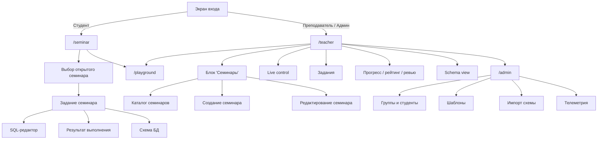

# Клиентская часть

Документ описывает структуру frontend, граф навигации и поведение основных экранов.

## 1. Роли и маршруты

Frontend работает как единое SPA-приложение с роль-зависимой навигацией.

Основные маршруты:

- `/overview`
  обзор и быстрый вход в преподавательский сценарий;
- `/seminar`
  семинарный режим;
- `/teacher`
  панель преподавателя;
- `/playground`
  режим свободной практики;
- `/admin`
  администрирование.

## 2. Граф навигации

## 3. Структура экранов

### 3.1. Экран входа

Компонент:
- [App.tsx](/Users/grigorevmp/Downloads/app/src/App.tsx)

Возможности:
- выбор режима `Студент` / `Преподаватель`;
- вход преподавателя по логину и паролю;
- вход студента по фамилии;
- восстановление сессии по JWT.

### 3.2. Семинарный режим студента

Компонент:
- [App.tsx](/Users/grigorevmp/Downloads/app/src/App.tsx)

Состав:
- выбор доступного семинара;
- список задач текущего семинара;
- редактор SQL;
- таблица результата;
- кнопка `Проверить решение`;
- раскрываемый блок `Схема БД`;
- референсное решение только если его открыл преподаватель.

### 3.3. Панель преподавателя

Компонент:
- [App.tsx](/Users/grigorevmp/Downloads/app/src/App.tsx)

Состав:
- блок `Семинары`;
- `Live control`;
- список задач;
- объединённый блок прогресса, рейтинга, уведомлений и ревью;
- `Schema view`;
- диалог создания задачи;
- управление настройками текущего семинара.

### 3.4. Playground

Компонент:
- [App.tsx](/Users/grigorevmp/Downloads/app/src/App.tsx)

Состав:
- выбор шаблона БД;
- фильтры по сложности и теме;
- список challenge-задач;
- SQL-редактор;
- результат выполнения;
- схема/диаграмма/примеры данных.

### 3.5. Админка

Компонент:
- [App.tsx](/Users/grigorevmp/Downloads/app/src/App.tsx)

Подразделы:
- `Группы и студенты`;
- `Шаблоны`;
- `Импорт схемы`;
- `Телеметрия`.

## 4. Архитектура frontend

Ключевые файлы:

- [App.tsx](/Users/grigorevmp/Downloads/app/src/App.tsx)
  основной shell, маршрутизация и экраны
- [api.ts](/Users/grigorevmp/Downloads/app/src/lib/api.ts)
  REST API клиент и WebSocket
- [index.css](/Users/grigorevmp/Downloads/app/src/index.css)
  визуальная система, сетки, панели, адаптивность
- [types.ts](/Users/grigorevmp/Downloads/app/src/types.ts)
  общие типы `catalog`, `runtime`, пользователей, семинаров, задач и шаблонов

## 5. Поток данных

Frontend получает данные в двух логических каналах:

- `catalog`
  относительно стабильные сущности:
  - пользователи;
  - группы;
  - семинары;
  - задачи;
  - шаблоны;
  - playground challenge.
- `runtime`
  текущее пользовательское и операционное состояние:
  - выбранный семинар;
  - выбранная задача;
  - черновики;
  - query runs;
  - submissions;
  - notifications;
  - event logs.

`catalog` и `runtime` приходят:

- после логина;
- при `bootstrap`;
- после любого `action`;
- по WebSocket при `state:update`.

## 6. Ограничения текущей клиентской части

- основной UI всё ещё собран в одном крупном [App.tsx](/Users/grigorevmp/Downloads/app/src/App.tsx);
- bundle остаётся крупным;
- Swagger UI в клиент не встроен;
- навигация role-aware, но не разделена на отдельные app-shell для каждой роли.
